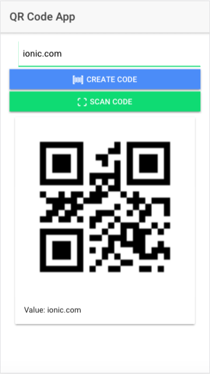
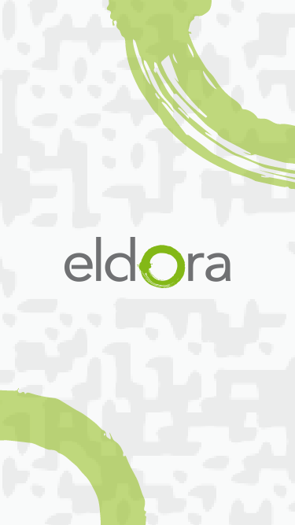
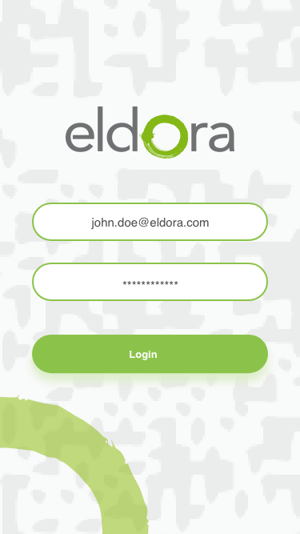
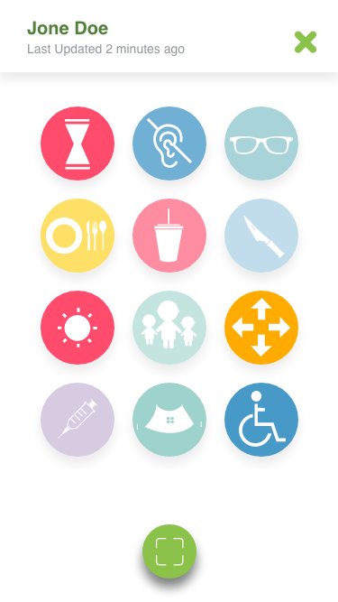
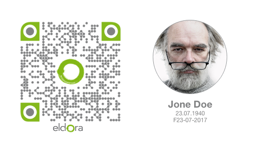

This is a starter template for [Ionic](http://ionicframework.com/docs/) projects.

## How to use this template

*This template does not work on its own*. The shared files for each starter are found in the [ionic2-app-base repo](https://github.com/ionic-team/ionic2-app-base).

To use this template, either create a new ionic project using the ionic node.js utility, or copy the files from this repository into the [Starter App Base](https://github.com/ionic-team/ionic2-app-base).

### With the Ionic CLI:

Take the name after `ionic2-starter-`, and that is the name of the template to be used when using the `ionic start` command below:

```bash
$ sudo npm install -g ionic cordova
$ ionic start myBlank blank
```

Then, to run it, cd into `myBlank` and run:

```bash
$ ionic cordova platform add ios
$ ionic cordova run ios
```

Substitute ios for android if not on a Mac.

### Here's the screenshot:




### push an existing repository from the command line

```bash
git remote add origin https://github.com/happybirdw/devQRCode.git
git push -u origin master
```

### clone an existing repository from the command line

```bash
git clone https://github.com/happybirdw/devQRCode.git
```

### new push modifications to an existing repository from the command line

```bash
git push origin master
```

## Mockup ELDORA ScanQRCode
|
|
|
|
|
